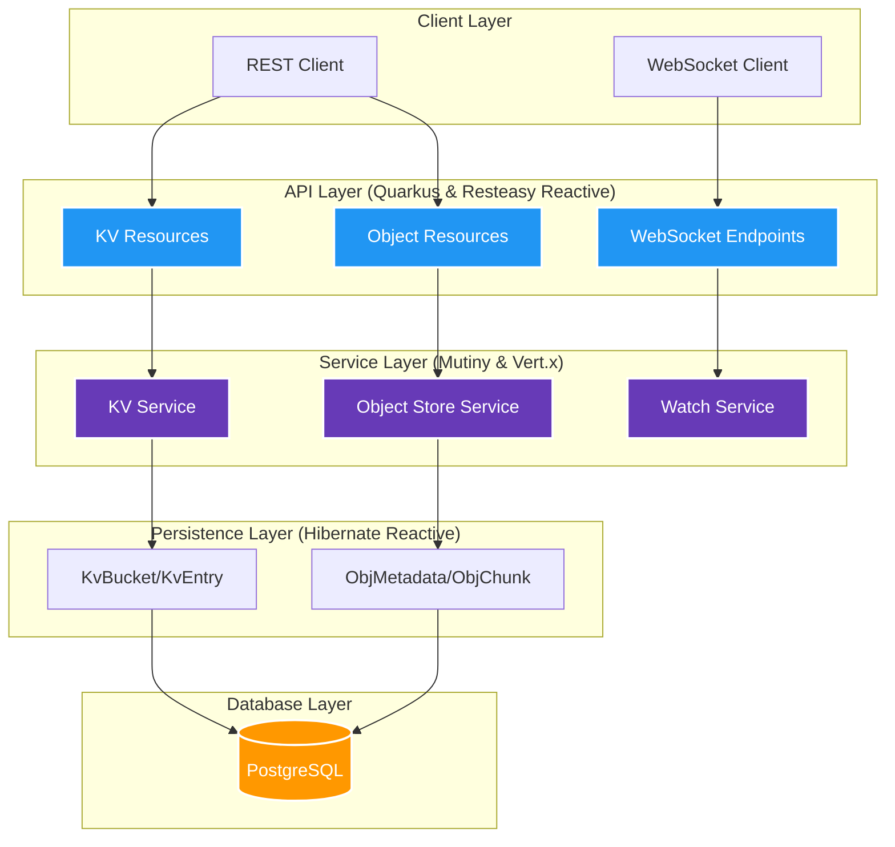

# KV und Object Store mit PostgreSQL

Ein hochperformanter, **vollständig reaktiver (non-blocking)** Microservice, entwickelt mit **Quarkus**, **Hibernate Reactive**, **Mutiny** und **PostgreSQL**, der verteilten Key-Value-Speicher und Object Storage in einer einzigen, transaktionalen Infrastruktur vereint.

Dieses Projekt implementiert Architekturmuster ähnlich wie [NATS JetStream](https://docs.nats.io/nats-concepts/jetstream) (KV und Object Store), nutzt jedoch die Zuverlässigkeit, transaktionale Integrität und Verbreitung von PostgreSQL als Persistenzschicht.

## 🚀 Warum diesen Service nutzen?

Dieser Microservice ist für Szenarien konzipiert, in denen operative Einfachheit, Datenkonsistenz und Transaktionssicherheit Vorrang vor extremem Hyperscale-Durchsatz haben.

### ✅ Ideale Anwendungsfälle

1.  **Infrastruktur-Konsolidierung ("Postgres ist genug")**:
    *   Vermeiden Sie den Betrieb komplexer separater Systeme wie Redis (für KV), MinIO/S3 (für Dateien) und Kafka (für Historie).
    *   Reduzieren Sie den operativen Aufwand und die Kosten, indem Sie Ihre bestehende hochverfügbare PostgreSQL-Infrastruktur nutzen.

2.  **Transaktionale Konsistenz (ACID)**:
    *   Atomare Operationen über Metadaten und Nutzdaten hinweg. Ein Objekt-Upload und seine Metadaten werden gemeinsam committet.
    *   Keine "verwaisten Dateien" mehr in S3, denen Datenbankeinträge fehlen, oder Datenbankeinträge, die auf fehlende Dateien zeigen.

3.  **Integrierte erweiterte Funktionen**:
    *   **Revisions-Historie**: Automatische Nachverfolgung von Wertänderungen über die Zeit (z.B. für Konfigurationsversionierung oder Audit-Logs).
    *   **Echtzeit-Überwachung (Watch)**: Empfangen Sie WebSocket-Push-Benachrichtigungen, wenn sich bestimmte Schlüssel oder Buckets ändern, was reaktive UIs ohne Polling ermöglicht.
    *   **Intelligentes Chunking**: Teilt große Dateien automatisch in verwaltete Blöcke auf, wodurch Objekte gespeichert werden können, die größer sind als die Limits von Postgres.

4.  **Cloud-Native & Serverless Ready**:
    *   Dank der Quarkus Native-Kompilierung startet der Service in Millisekunden und hat einen winzigen Speicherbedarf (<50MB RSS), was ihn kosteneffizient für Scale-to-Zero-Umgebungen macht.

### ❌ Wann man dies NICHT nutzen sollte

*   **Hyperscale Object Storage**: Wenn Sie Terabytes an Videos oder Backups speichern müssen, ist dedizierter Object Storage (S3, GCS, Azure Blob) kosteneffizienter und skalierbarer als eine relationale Datenbank.
*   **Extrem niedrige Latenz (High-Frequency KV)**: Für Anwendungsfälle, die Lese-/Schreiblatenzen im Sub-Millisekundenbereich bei Millionen von Operationen pro Minute erfordern (z.B. Hochfrequenzhandel), sind In-Memory-Stores wie Redis oder KeyDB überlegen.

## Funktionen

### Key-Value Store
- **Buckets**: Erstellen, Löschen und Auflisten logischer Namensräume für Schlüssel
- **CRUD-Operationen**: Put-, Get-, Delete-Operationen mit atomaren Updates
- **Revisions-Historie**: Automatische Versionierung mit konfigurierbarer Historientiefe
- **CAS (Compare-And-Swap)**: Atomare Updates basierend auf der erwarteten Revision
- **TTL-Support**: Optionale Time-to-Live für automatischen Ablauf von Schlüsseln
- **Watch**: Echtzeit-Änderungsbenachrichtigungen via WebSocket

### Object Store
- **Buckets**: Logische Namensräume zur Organisation von Objekten
- **Chunked Storage**: Automatische Aufteilung großer Dateien (konfigurierbare Chunk-Größe)
- **Range Requests**: Unterstützung für partielle Downloads (HTTP Range Header)
- **Streaming**: Effizienter Streaming-Upload und -Download
- **Integrität**: SHA-256 Hash-Verifizierung
- **Metadaten**: Content-Type, Beschreibung und benutzerdefinierte Header

### Zusätzliche Funktionen
- **Multi-Mandantenfähigkeit**: Datenisolierung durch Row Level Security (RLS) via `X-Tenant-ID`
- RESTful API mit OpenAPI/Swagger Dokumentation
- WebSocket-Endpunkte zur Echtzeit-Überwachung
- Health Checks (Liveness und Readiness Probes)
- Prometheus Metriken
- Rollenbasierte Autorisierung (OIDC/JWT ready)
- Datenbank-Migrationen mit Flyway
- Docker-Support mit Multi-Stage-Builds

## ⚙️ Technische Spezifikationen & Limits

| Komponente | Parameter | Standardwert | Konfigurierbar | Beschreibung |
|------------|-----------|--------------|----------------|--------------|
| **KV Store** | Max. Value Größe | 1 MB | Ja | Applikationsseitiges Limit (Postgres unterstützt bis zu 1 GB). |
| **KV Store** | Max. Key Länge | 255 Zeichen | Nein | Maximale Länge eines Schlüssels. |
| **KV Store** | Max. Historie | 100 Revisionen | Ja | Anzahl der gespeicherten Versionen pro Key. |
| **Object Store** | Max. Objektgröße | 1 GB | Ja | Applikationslimit (durch Chunking theoretisch nur durch Festplattenspeicher begrenzt). |
| **Object Store** | Chunk Größe | 1 MB | Ja | Größe der Einzelblöcke, in die Dateien zerlegt werden. |
| **Allgemein** | Transaktions-Isolation | Read Committed | (DB-Level) | Standard PostgreSQL Isolation Level. |


## Voraussetzungen

- Java 21+
- Maven 3.9+
- Docker und Docker Compose (für containerisiertes Setup)
- PostgreSQL 14+ (oder Docker verwenden)
- **Devbox** (Optional, für ein isoliertes Setup aller Abhängigkeiten)

## Schnellstart

### Option 1: Devbox (Schnellster lokaler Start)
Wenn Sie [devbox](https://www.jetpack.io/devbox) installiert haben, können Sie die gesamte Entwicklungsumgebung (JDK, Maven, Postgres-Tools) mit einem Befehl starten:

```bash
devbox shell
# Danach im Shell:
mvn quarkus:dev
```

### Option 2: Docker Compose (Für Container-Betrieb)

```bash
# Starten von PostgreSQL und dem Service
docker-compose up -d

# Logs anzeigen
docker-compose logs -f kvstore

# Der Service ist verfügbar unter http://localhost:8080
```

### Option 2: Lokale Entwicklung

1. **PostgreSQL starten**:
```bash
# Mit Docker
docker run -d --name kvstore-postgres \
  -e POSTGRES_DB=kvstore \
  -e POSTGRES_USER=postgres \
  -e POSTGRES_PASSWORD=postgres \
  -p 5432:5432 \
  postgres:16-alpine

# Oder die Dev-Compose-Datei nutzen
docker-compose -f docker-compose.dev.yml up -d
```

2. **Anwendung im Dev-Modus starten**:
```bash
./mvnw quarkus:dev
```

Die Anwendung startet mit aktiviertem Hot-Reload unter http://localhost:8080

## API Dokumentation

Sobald die Anwendung läuft, können Sie die Swagger UI aufrufen unter:
- **Swagger UI**: http://localhost:8080/swagger-ui
- **OpenAPI Spec**: http://localhost:8080/openapi

## API Beispiele

### Key-Value Store

#### Bucket erstellen
```bash
curl -X POST http://localhost:8080/api/v1/kv/buckets \
  -H "Content-Type: application/json" \
  -d '{"name": "my-bucket", "description": "Mein KV Bucket"}'
```

#### Schlüssel setzen (Put)
```bash
curl -X PUT http://localhost:8080/api/v1/kv/buckets/my-bucket/keys/my-key \
  -H "Content-Type: application/json" \
  -d '{"value": "Hallo Welt!", "base64": false}'
```

#### Atomares Update (CAS)
Führt ein Update nur durch, wenn die aktuelle Revision mit `expectedRevision` übereinstimmt.

```bash
curl -X PUT "http://localhost:8080/api/v1/kv/buckets/my-bucket/keys/my-key?expectedRevision=1" \
  -H "Content-Type: application/json" \
  -d '{"value": "Neuer Wert", "base64": false}'
```

#### Schlüssel abrufen (Get)
```bash
curl http://localhost:8080/api/v1/kv/buckets/my-bucket/keys/my-key
```

#### Schlüssel-Historie abrufen
```bash
curl http://localhost:8080/api/v1/kv/buckets/my-bucket/keys/my-key/history?limit=10
```

#### Änderungen überwachen (WebSocket)
```bash
# Mit websocat
websocat ws://localhost:8080/api/v1/kv/watch/my-bucket
```

### Object Store

#### Objekt-Bucket erstellen
```bash
curl -X POST http://localhost:8080/api/v1/objects/buckets \
  -H "Content-Type: application/json" \
  -d '{"name": "my-files", "description": "Dateispeicher"}'
```

#### Objekt hochladen
```bash
curl -X PUT http://localhost:8080/api/v1/objects/buckets/my-files/objects/dokument.pdf \
  -H "Content-Type: application/pdf" \
  -H "X-Object-Description: Wichtiges Dokument" \
  --data-binary @dokument.pdf
```

#### Objekt herunterladen
```bash
curl -O http://localhost:8080/api/v1/objects/buckets/my-files/objects/dokument.pdf
```

#### Partieller Download (Range Request)
Laden Sie nur einen Teil der Datei herunter (z.B. die ersten 500 Bytes).

```bash
curl -H "Range: bytes=0-499" -o teil-dokument.pdf http://localhost:8080/api/v1/objects/buckets/my-files/objects/dokument.pdf
```

#### Objekt-Integrität prüfen
```bash
curl http://localhost:8080/api/v1/objects/buckets/my-files/objects/dokument.pdf/verify
```

## Multi-Mandantenfähigkeit (Multi-Tenancy)

Der Service unterstützt vollständige Datenisolierung zwischen Mandanten durch **Row Level Security (RLS)** auf Datenbankebene. Die Implementierung ist robust und erzwingt Isolation auch für den Datenbank-Superuser (`FORCE RLS`).

Um auf einen spezifischen Mandantenbereich zuzugreifen, senden Sie einfach den `X-Tenant-ID` Header mit jeder Anfrage:

```bash
# Daten für Tenant A speichern
curl -X PUT http://localhost:8080/api/v1/kv/buckets/shared-bucket/keys/config \
  -H "X-Tenant-ID: tenant-a" \
  -d '{"value": "Config A"}'

# Daten für Tenant B speichern (selber Bucket-Name, aber isoliert)
curl -X PUT http://localhost:8080/api/v1/kv/buckets/shared-bucket/keys/config \
  -H "X-Tenant-ID: tenant-b" \
  -d '{"value": "Config B"}'
```

*Hinweis: Wenn kein Header gesendet wird, wird der Standard-Mandant (`default`) verwendet.*

## Konfiguration

Die Konfiguration erfolgt über `application.properties` oder Umgebungsvariablen:

| Property | Umgebungsvariable | Standard | Beschreibung |
|----------|-------------------|----------|--------------|
| `quarkus.datasource.reactive.url` | `DB_URL` | localhost:5432/kvstore | Datenbankverbindung (Reactive) |
| `quarkus.datasource.username` | `DB_USERNAME` | postgres | Datenbank-Benutzer |
| `quarkus.datasource.password` | `DB_PASSWORD` | postgres | Datenbank-Passwort |
| `kv.max-value-size` | `KV_MAX_VALUE_SIZE` | 1048576 (1MB) | Max. Wertgröße in Bytes |
| `kv.max-history-size` | `KV_MAX_HISTORY_SIZE` | 100 | Max. Revisionen pro Schlüssel |
| `objectstore.chunk-size` | `OBJECTSTORE_CHUNK_SIZE` | 1048576 (1MB) | Chunk-Größe für Objekte |
| `objectstore.max-object-size` | `OBJECTSTORE_MAX_OBJECT_SIZE` | 1073741824 (1GB) | Max. Objektgröße |

## Health & Metrics

- **Liveness**: http://localhost:8080/health/live
- **Readiness**: http://localhost:8080/health/ready
- **Metrics**: http://localhost:8080/metrics

## Testen

Der Service verfügt über eine umfassende Testsuite mit **181 automatisierten Tests**, die sowohl Unit- als auch Integrationstests abdecken.

```bash
# Unit- und Integrationstests ausführen
./mvnw test
```

Alle Tests verwenden reaktive Asserter (`TransactionalUniAsserter`), um die Integrität der non-blocking Datenbanktransaktionen zu verifizieren.

### Test-Profile
- **Standard**: Nutzt die konfigurierte PostgreSQL-Datenbank.
- **Testcontainers**: Kann für isolierte Integrationstests genutzt werden:
  ```bash
  ./mvnw verify -Dquarkus.test.integration-test-profile=test
  ```

## Benchmark Ergebnisse

Der Service wurde einem Lasttest (1000 Operationen, Concurrency 20) unterzogen, um die Leistungsfähigkeit des reaktiven Stacks zu demonstrieren.

> [!NOTE]
> Die Ergebnisse können je nach Hardware und Datenbankkonfiguration (z.B. SSD vs. HDD, Netzwerk-Latenz) variieren. Der reaktive Stack ermöglicht jedoch eine effiziente Nutzung der Ressourcen bei hoher Nebenläufigkeit.
>
> **WRITE RESULTS:**
> Total Time: 1132 ms
> Throughput: 883,39 ops/sec
> Avg Latency: 1,13 ms/op
>
> **READ RESULTS:**
> Total Time: 275 ms
> Throughput: 3636,36 ops/sec
> Avg Latency: 0,28 ms/op

| Operation | Durchsatz (ops/sec) | Latenz (ms/op) |
|-----------|----------------------|----------------|
| **Write** | 883.39               | 1.13           |
| **Read**  | 3636.36              | 0.28           |

*Getestet auf lokaler Hardware mit PostgreSQL 16 (reaktiver Treiber).*

## Bauen (Building)

### JVM Build
```bash
./mvnw package
java -jar target/quarkus-app/quarkus-run.jar
```

### Native Build (erfordert GraalVM)
```bash
./mvnw package -Pnative
./target/kv-ostore-psql-1.0.0-SNAPSHOT-runner
```

### Docker Build
```bash
# JVM Image
docker build -t kv-ostore-psql:latest .

# Native Image
docker build -f Dockerfile.native -t kv-ostore-psql:native .
```

## Überlegungen für den Produktionseinsatz

### Hochverfügbarkeit (High Availability)

Für Produktions-Deployments mit hoher Verfügbarkeit:

1. **Datenbank**: Nutzen Sie PostgreSQL mit Streaming Replication oder einen Managed Service (AWS RDS, Cloud SQL, etc.).

2. **Mehrere Instanzen**: Lassen Sie mehrere Service-Instanzen hinter einem Load Balancer laufen.
   ```yaml
   # docker-compose.prod.yml
   kvstore:
     deploy:
       replicas: 3
   ```

3. **Connection Pooling**: Verwenden Sie PgBouncer oder ähnliches für Connection Pooling.

4. **Caching**: Erwägen Sie Redis für das Caching häufig abgerufener Schlüssel.

### Sicherheit

1. **OIDC aktivieren**: Konfigurieren Sie Ihren Identity Provider.
   ```properties
   quarkus.oidc.enabled=true
   quarkus.oidc.auth-server-url=https://your-idp.com/realms/your-realm
   quarkus.oidc.client-id=kv-ostore
   ```

2. **TLS**: Nutzen Sie in Produktion immer HTTPS.

3. **Netzwerk-Richtlinien**: Beschränken Sie den Datenbankzugriff nur auf Anwendungs-Pods.

### Monitoring

1. **Prometheus + Grafana**: Scrapen Sie den `/metrics` Endpunkt.

2. **Logging**: Konfigurieren Sie JSON-Logging für die Produktion.
   ```properties
   quarkus.log.console.json=true
   ```

3. **Distributed Tracing**: Aktivieren Sie die OpenTelemetry-Integration.

## Architektur


### Komponenten-Übersicht



## Lizenz

Dieses Projekt ist unter der Apache License 2.0 lizenziert.
